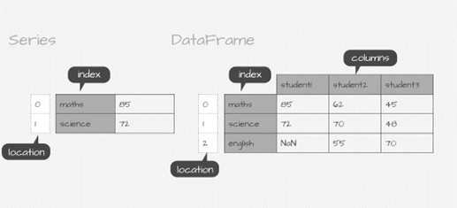
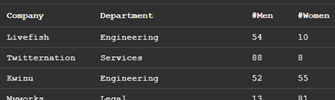

# DATA STRUCTURES


## Jupiter Notebook

### Introduction

1. A Jupyter notebook is a web-based interactive environment for creating and sharing documents that contain code, text, and visualizations. It is a powerful tool for data science, machine learning, and other technical fields.

1. A notebook consists of cells of various types. You can enter text into a text cell that is used to describe information. In a cell you can run, you can enter instructions in a programming language such as Python. After running such a cell, the result is usually displayed below.


### First Notebook

1. Open the notebook my-first-notebook.ipynb. 

1. Read the contents of the notebook and complete all tasks.

1. Create your first notebook called bmi.ipynb. Enter the person's height in cm and weight in kg using the keyboard. Then, calculate the BMI (Body Mass Index). Display height, weight and calculated BMI.


## Pandas Library

### Introduction

1. Pandas is a software library written for the Python programming language for data manipulation and analysis. In particular, it offers data structures and operations for manipulating numerical tables and time series.

1. Pandas is built around data structures called Series and DataFrames. Data for these collections can be imported from various file formats such as comma-separated values (CSV), JSON, Parquet, SQL database tables or queries, and Microsoft Excel.

1. To use Pandas, first you need to download and install this library. Then, to use it in your notebook, import the library using the statement:

    ```python
    import pandas as pd
    ```


### Data Model

1. A Series is a 1-dimensional data structure. Each data point has an associated label. The collection of these labels is called an index.

1. A DataFrame is a 2-dimensional data structure of rows and columns, similar to a spreadsheet.

1. Pandas Data Model

    

1. Watch the video to become familiar with the Pandas data model.

    a. Series
        (https://youtu.be/sZfm63OjWGE?feature=shared) 

    b. DateFrame
        (https://youtu.be/cllz3subduA?feature=shared) 
   


## Data Creation

### Series

1. Open the notebook my-first-series.ipynb. Learn how to create Series based on data collections. Then, complete all tasks in the notebook.

1. Kraków had a recorded population of 774,839 in 2019, which increased to 804,237 in 2023. Detailed information can be found at:

    <https://en.wikipedia.org/wiki/Krak%C3%B3w>

    Create a Jupyter Notebook named krakow.ipynb. Then, in the notebook, create a Series containing information about the population of Krakow in the years 1985 to 2023. Display the contents of the Series along with the descriptive statistics.

### DataFrame

1.	Open the notebook my-first-dataframe.ipynb. Learn how to create DataFrame based on data collections. Then, complete all tasks in the notebook.

1. The CSV file contains information about the number of men and women employed in company departments.

    
 
    Using Mockaroo (https://mockaroo.com), generate 20 rows of data with the given structure. Save the data in the companies.csv file. Then, create a companies.ipynb notebook, in which create a DataFrame, based on the data contained in the CSV file. Display the contents of the DataFrame. Calculate and display:

    * the total number of men working in companies
    * average number of women working in companies


## Data Manipulation

### Row and Column Selection

1. You can indicate rows and/or columns that will then be further processed. A DataFrame contains the loc[] and iloc[] methods that allow access to specified rows and columns.

    a. loc[row,column] – selection based on row/column names\
    <https://pandas.pydata.org/pandas-docs/stable/reference/api/pandas.DataFrame.loc.html>

    b. iloc[row,column] – selection based on row/column numbers\
    <https://pandas.pydata.org/pandas-docs/stable/reference/api/pandas.DataFrame.iloc.html>

1.	Open the notebook rows-and-columns.ipynb. Learn how to access rows and columns in a DataFrame. Then, complete all tasks in the notebook.

1. ZADANIA

### Data Export

1. You can save data, limited by specifying rows and columns, to a file. There are a number of data formats at your disposal, including the most commonly used: CSV, JSON, HTML.

1. Open the notebook data-to-file.ipynb. Learn how to save a DataFrame to a file. Then, complete all tasks in the notebook.

1. ZADANIA
